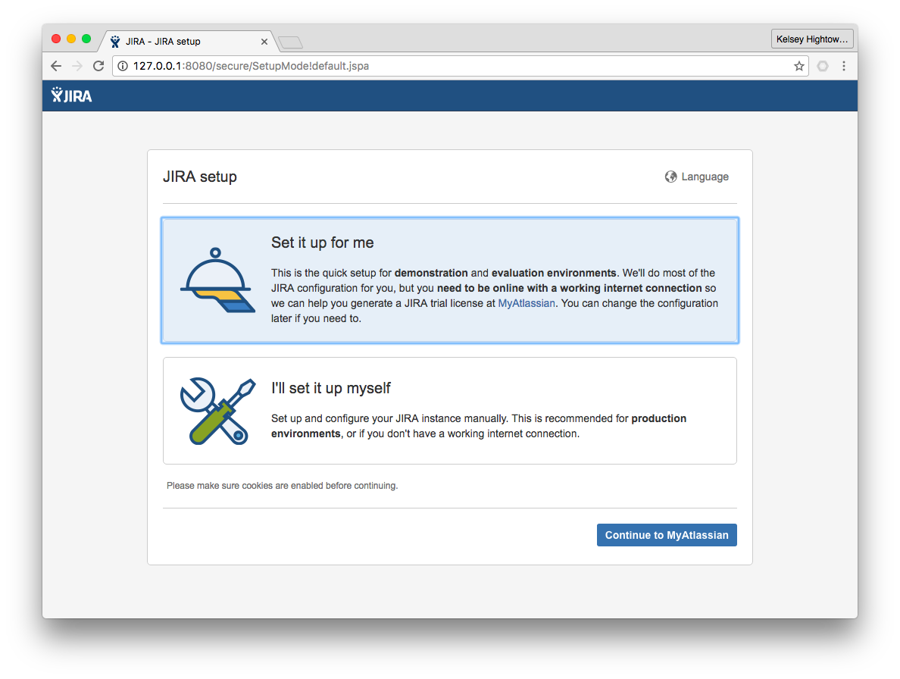
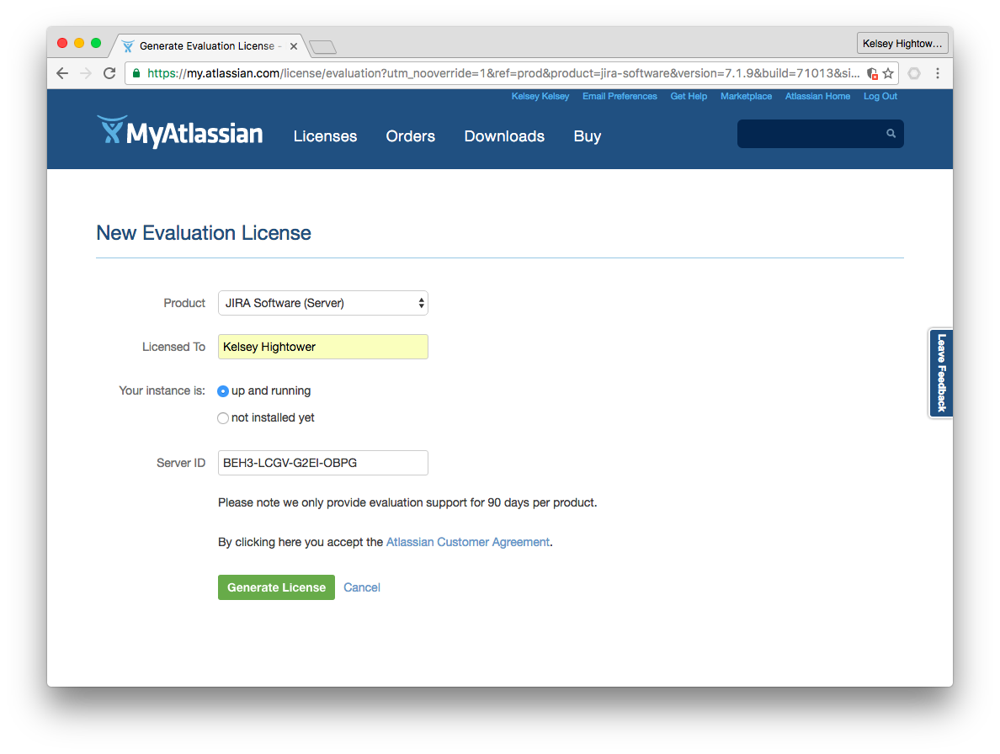
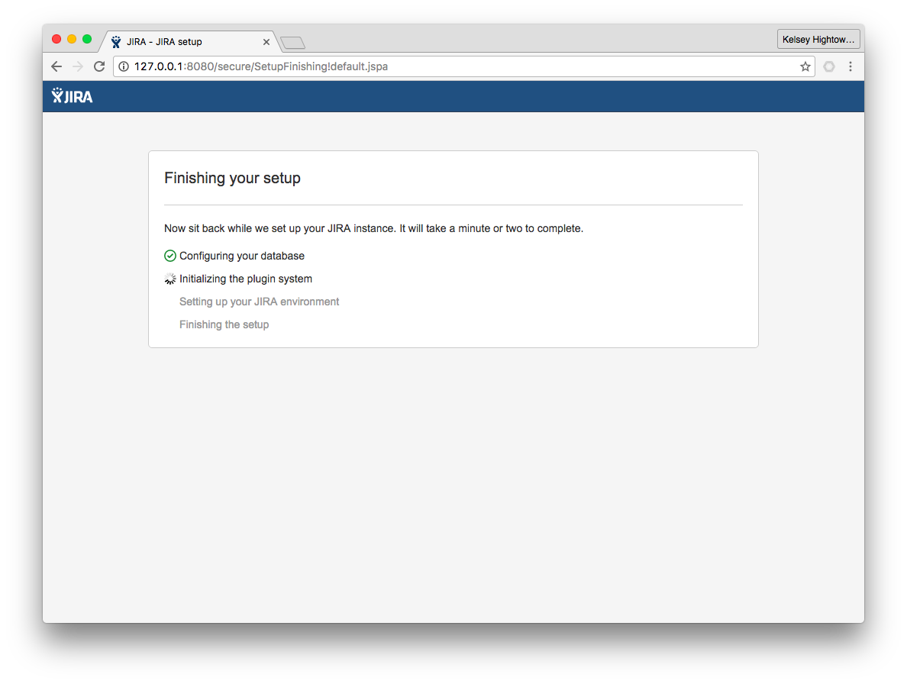
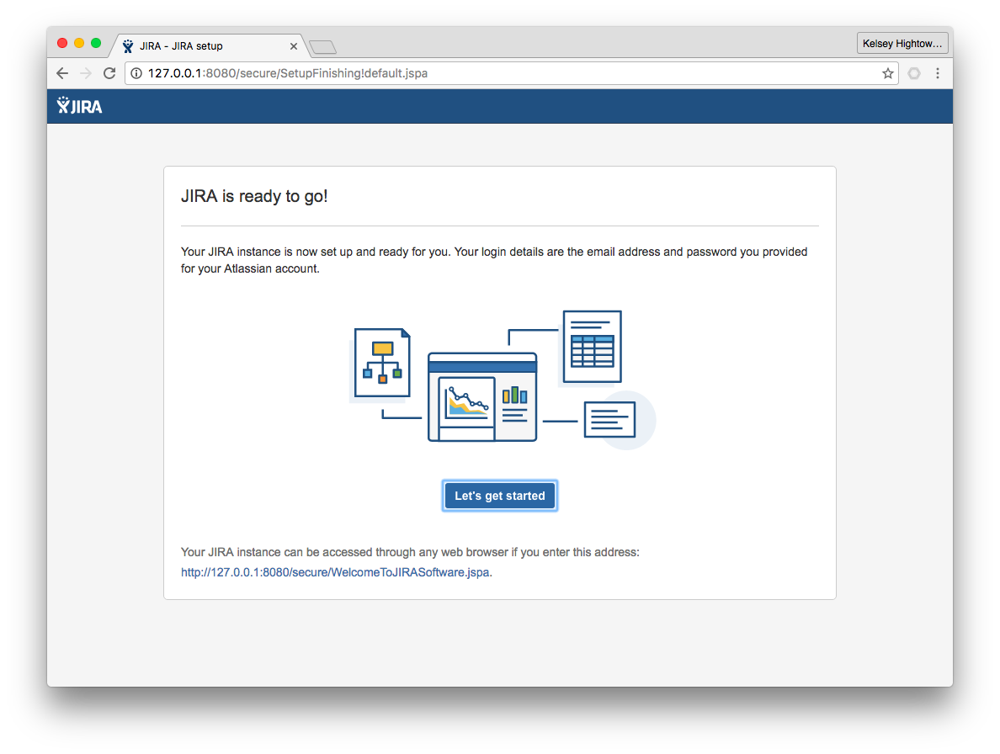

# Jira on GKE

These are my notes on setting up a Jira Server on Google Cloud Platform and k8s.

## Overview

- This guide is only showing the high level steps to provision a Jira setup for GKE
- This is production ready. I used Jira like this in production.

## References

- Deployment for the Jira server in the latest version. To customize this, edit the DOCKERFILE in this project
	* [Atlassian JIRA Software in a Docker container](https://hub.docker.com/r/cptactionhank/atlassian-jira-software)
- Used Persistent Volume (PV) and Persistent Volume Claim (PVC) for `jira-home` directory
 	* [Configure a Pod to Use a PersistentVolume for Storage](https://kubernetes.io/docs/tasks/configure-pod-container/configure-persistent-volume-storage/)
- CloudSQL Proxy like a container sidecar
	* [CloudSQL Proxy Docs.](https://cloud.google.com/sql/docs/postgres/sql-proxy)
- Nginx for proxy httpd like a container sidecar
	* [NGINX Docker Container](https://hub.docker.com/_/nginx/)
	
## Usage

There are data to be "customized" manually:

### Configure Instance Database - CloudSQL

[How to Use CloudSQL Proxy](https://cloud.google.com/sql/docs/postgres/sql-proxy)

- **PROJECT_NAME:REGION:INSTANCE_NAME** - jira-deployment.yaml

### Public URL

- **JIRA_URL** - jira-deployment.yaml, jira-configmap-server.yaml and jira-configmap.nginx.yaml

### HTTPS

[Creating a Secret Manually](https://kubernetes.io/docs/concepts/configuration/secret/#creating-a-secret-manually)

- **CRT_HASH** - tls.crt
- **KEY_HASH** - key.crt

**NOTE:** I'm going to start from the premise that there is a Postgresql database instance already configured.

### Jira Deployment

1 - Run in project folder:

```
kubectl create ns jira-cloud && kubectl -n jira-cloud create -f ./
```

This may take a while! Currently this container is big! Like `873 MB` big. I'll improve that later.

```
kubectl get pods
```
```
NAME                          READY   STATUS              RESTARTS   AGE
jira-cloud-7f8dcd97b9-lmhg6   0/3     ContainerCreating   0          2s
```

3 - Once the download completes you'll be good to go:

```
$ kubectl get pods
```
```
NAME                          READY   STATUS    RESTARTS   AGE
jira-cloud-7f8dcd97b9-lmhg6   3/3     Running   0          23h
```

### Configure Jira

Access your Jira install using a local port forward. You don't want to get hacked right out of the gate.

```
kubectl port-forward jira-cloud-7f8dcd97b9-lmhg6 8080:80
```
```
Forwarding from 127.0.0.1:8080 -> 80
Forwarding from [::1]:8080 -> 80
```

Visit http://127.0.0.1:80 in your browser and complete the initial setup.






### External Service

Once you have Jira all setup you can expose it on the public internet. This setup is secure so you'll need to do some extra work get HTTPS working. Just create a secret with the name "tls-https".

```
kubectl get svc -n jira-cloud
```
```
NAME         TYPE           CLUSTER-IP      EXTERNAL-IP       PORT(S)                      AGE
jira-cloud   LoadBalancer   10.59.247.201   xxx.xxx.xxx.xxx   443:31724/TCP,80:30625/TCP   12d

```

At this point you can visit Jira on http://xxx.xxx.xxx.xxx or https://xxx.xxx.xxx.xxx .

## References

Project forked of [Jira on kubernetes](https://github.com/kelseyhightower/jira-on-kubernetes)
